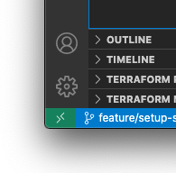
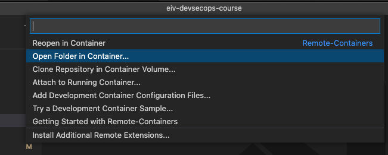
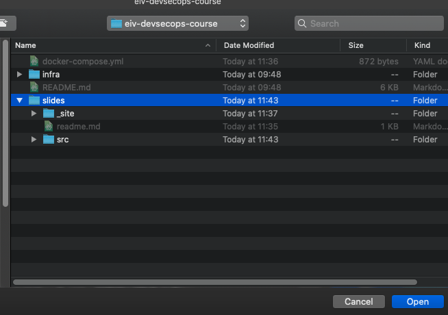

# Static Website de Curso de Verano "DevSecOps y SRE"

Este proyecto contiene las diapositivas del curso de verano "DevSecOps y SRE". Las diapositivas han sido creadas en el framework [remark](https://github.com/gnab/remark/), con el próposito de ilustrar la práctica de _Everything as code_.

## Comienza rápido

El proyecto usa la tecnología de `Dev Containers` para su desarrollo. Para facilitar el desarrollo en en entorno local, el contenedor está preconfigurado con [Jekyll](https://jekyllrb.com/) para _servir_ contenido estático en el directorio `/workspace/slides`.

### Prerequisitos
- Vscode
- Docker
- Extensión [Remote Containers](https://marketplace.visualstudio.com/items?itemName=ms-vscode-remote.remote-containers)

### Instalación

1. Abrir `vscode` en el repositorio. 
2. Abrir la extensión `Remote Containers`  
    
3. Seleccionar `Open Folder in Container ...`
    
4. Seleccionar la carpeta `slides`  
    
5. Después de que el contenedor esté listo, navegar al [Inicio del Curso en `http://localhost:4000`](http://localhost:4000) en su entorno local.

## Contribuir

Las diapositivas se localizan en la carpeta `slides/src`. Dentro de esta carpeta están todos los recursos (`.md`, `.html`, `.png`) que son servidos estáticamente.

Las diapositivas son archivos de `Markdown` (un simple [Getting started acá](https://docs.github.com/en/get-started/writing-on-github/getting-started-with-writing-and-formatting-on-github/basic-writing-and-formatting-syntax)) con notación especial para `remark`, más información en esta [pequeña guía](https://github.com/gnab/remark/wiki/Markdown).