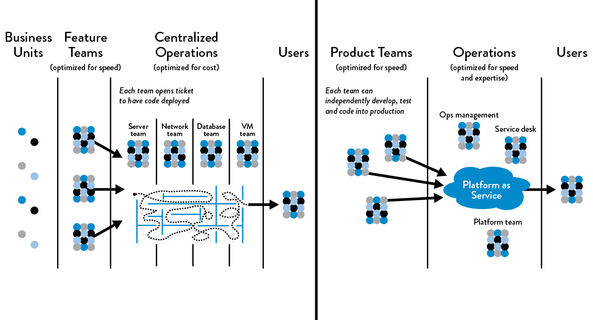
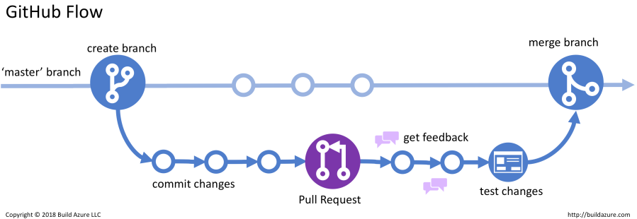

class: center, middle

# DevSecOps y SRE

## para el diseño , desarrollo y operación de sistemas de información modernos.

---

.left-column[
Quién soy?  


]
.right-column[

# Sebastián Aguado Bedoya

- Egresado de la ECI del programa de Ingeniería de Sistemas

- +10 años de experiencia en Desarrollo de Software, +4 ãnos de experiencia prácticando DevSecOps

- Actualemente trabajo como _Senior Cloud Engineer_ en Neptune Software AS

- LinkedIn: [s-aguado](https://www.linkedin.com/in/s-aguado/)
]
???
# 5 min (5 min)
---

# Historía de DevSecOps

.center[
  <iframe width="560" height="315" src="https://www.youtube.com/embed/kBV8gPVZNEE?cc_lang_pref=es&cc_load_policy=1" title="What is DevOps?" frameborder="0" allow="accelerometer; autoplay; clipboard-write; encrypted-media; gyroscope; picture-in-picture" allowfullscreen></iframe>
]

- Lean Manufactoring / Toyota Kaya
- 2007 / 2008
- Discusiones y _meetups_
- Devops days 2009, Ghent Bélgica
- Adopción en gran escala
???
# 10 minutos (15 min)
- Hablar de metodologías ágiles y las fábricas de Toyota
- https://legacy.devopsdays.org/events/2009-ghent/program
---
.left-column[
Intro
]
.right-column[
# Qué es Devops?

- No hay una definición formal

> Conjunto de prácticas y procesos que empoderan a un equipo de desarrollo a crear valor de manera ágil y segura.

- C.A.L.M.S
  - Cultura
  - Automatización
  - Lean
  - Medición
  - _Sharing_ 

- _You build it, you run it_
]
???
# 10 minutos (25 min)
---
class: center, middle

---
.left-column[
Intro
]
.right-column[
# La paradoja

- Dev quiere crear cambio constante
- OPS quiere estabilidad

- Calidad afectada
- Desarrollador no conoce cómo u software funciona en la realidad
- Procesos largos para que cambios tengan efecto
]
???
# 10 minutos (35 min)
- Hablar de la espiral de bajada
- Every company is a software company
---
.left-column[
Dónde Empezar?
]
.right-column[
# Flujos de Valor (_Value Stream_)
- Hacer el ejercicio de _Value Stream Mapping_
- Qué parte del sistema genera valor al cliente?
- Generar iniciativas
  - (_ej._) Eliminar testing como una fase, incuirlo al día a dia
  - (_ej._) Reducir el tiempo ed despliegues

- __Objetivo__: Incrementar la productividad del equipo de desarrollo
]
???
# 20 minutos (55min)
- Value Stream: Desde que una idea se concibe hasta que está a manos del cliente.
- Cliente: Quién se beneficia del sistema
---
.left-column[
Dónde empezar?
]
.right-column[
## Tipos de Projectos

- Greenfield: Empezar desde 0
- Brownfield: Proyectos que ya tienen madures.

### Claves para transformación
- Escoger personas simpatéticas e innovadoras
- Crecer de manera __silenciosa__
- Convencer a los opositores.
]
???
# 10 min (1h 5m)
---
.left-column[
Dónde empezar?
]
.right-column[
## Cómo fomentar la _evolución_ del flujo de Valor
1. Estar de acuerdo en una meta en común
2. Planear mejoras a corto plazo
3. Usar 20% del ciclo de dessarrollo para reducir la _deuda técnica_.
4. Usar las herramientas apropiadas para alcanzar el estado desdeado.
    _The righ tools for the right job_
]

???
# 10 min (1h 15m)
1. Ejemplos de metas comunes
  - Reduce the percentage of the budget spent on product support and unplanned work by 50%.
  - Ensure lead time from code check-in to production release is one week or less for 95% of changes.
  - Ensure releases can always be performed during normal business hours with zero downtime.
  - Integrate all the required information security controls into the deployment pipeline to pass all required compliance requirements.
---
.left-column[
Diseño del equipo
]
.right-column[
  
- Desarrollo, Testing, Operaciones y Seguridad es parte del trabajo de cada miembro. Un equipo de generalistas
- Incluir _Ops_ en todos los días del desarrollo
  - Self-service
  - Tener un miembro dedicado ó alquilado del equipo _OPS_
  - OPS debe ser integrado en los rituales DEV (sprint planning, retro, etc)
]
???
# 10 min (1h 15m)
Un equipo puede ser como un producto de Azure
Las tareas de OPS deben aparecer en el tablero kanban
---
.left-column[
DEV
]
.right-column[
- Obtener código fuente
- Cómo contribuir?
- Entornos de desarrollo efímeros
- Greenfield / Brownfield
- Flujos de desarrollo
  - Gitflow
  - Githubflow
- Controles locales
- Contribuir a _trunk_
- Colaboración basada en _Pull Request_
- CI/CD
- Actividades adicionales de desarrollo
- Intro a Infrastructure as Code
- Desarrollo a base de incremento de valor
- Extra: 12 factor development
]
---
.left-column[
DEV
]
.right-column[
## Obtener código fuente
- Sistema de versionamiento de Código (_VCS Version Control System_)
  - GIT
  - Subversion
  - Team Foundation
- Arquitectura de VCS
  - Monorepo
  - Múltiples repositorios
]

???
# 5 - 10 min (1h 25min)
- Comentar experiencia con herramientas como Github, GitLab, Az Devops
- Empezar con uno solo, y luego transicionar a múltiples.
- Recomendar usar GIT y sus variaciones
---
.left-column[
DEV
]
.right-column[
# Cómo contribuir al código fuente?
- Qué es el archivo README?
- Qué es importante tener en un archivo readme.md
- Otra información relevante
  - Guía de contribución y _Code of Conduct_
  - Estado de CI
  - Contactos, changelog, codeowners
]
???
# 5 min (1h 30m)
- https://github.com/hashicorp/terraform/blob/main/README.md
- Guía de contribución en este link: https://github.com/hashicorp/terraform/blob/main/.github/CONTRIBUTING.md
## TODO
- Modificar readme que refleje lo importante.
  - Herramientas
  - Cómo compilar
  - Cómo correr local
---
.left-column[
DEV
]
.right-column[
## Entornos de desarrollo efímeros
- El problema de "_funciona en mi PC_"
- Alternativas para replicación
  - Scripts
  - Docker y Dev Containers
  - Virtual Environments
- Entorno local de pruebas
]

???
# 5 min y 10 laboratios (1h 45 min)
- Hablar de arquitecturas que facilitan lo anterior.
- Ejemplo de una app movil preguntar
---
.left-column[
# DEV
]
.right-column[
# A trabajar!
## Greenfield
- Consideraciones
- La importacia de _templating_
- Es común con:
  - Bibliotecas
  - Microservicio

## Brownfield
- *Importante*: Es mala practica contribuir directamente en _trunk_
- Hay diferentes actividades en el ciclo de desarrollo
  - Bugfix
  - Hotfix
  - Release
- Introducción de los _flujos_ de colaboración
]

???
# 5 - 10 min (2h)
- Consideraciones: Que es el desafio de un bootstrap
---
.left-column[
DEV
]
.right-column[
## Gitflow
.center[[]](https://nvie.com/posts/a-successful-git-branching-model/)
]

???
# 20 mins (2h 20m)
- Explicar toda la historia
- PROS:
  - Funciona bien en un monorepo
  - Buena opción para ciclos de desarrollo largo (no recomendable )
- CONS:
  - Mucha disciplina para escoger el flujo correcto
  - En multiples repositorios no es sostenible.
  - Experiencia en Kredinor.
---
.left-column[
DEV
]
.right-column[
# Github flow



- PROS:
  - Efectivo para ciclos cortos
  - Óptimo si se trabaja en múltiples repositorios
  - _Peer Review_

- CONS:
  - Requiere disciplina
  - Rápidamente puede incorporar muchas herramientas adicionales
]
???
# 15 min (2h 35m)
- Hablar acerca de propios entornos para hacer pruebas
- Importante mantener una historia limpia.
---
.left-column[
DEV
]
.right-column[
## Controles locales (_local CI/CD_)
- Primera línea de defensa
- Primera línea de feedback

### Tecnologías
- Git hooks
- Tareas en pre-commit
  - Linting
  - Unit testing
  - Autogeneración de documentación
]
???
# 5-10 min (2h 45m)
---
.left-column[
DEV
]
.right-column[
## Colaborando a _trunk_
En términos técnicos `push`
- Cambios continuos
- Cambios grandes pueden ser contraproducentes
- Es díficil si un cambio requiere colaborar en múltiples repositorios

  ### Recomendaciones
- Referencia a la tarea que se trabaja
- No tener miedo de colaborar, fallar y revertir!
- Mantener una historia líneal
]
???
# 5-10 minutos (2h 55m)
---
.left-column[
DEV
]
.right-column[
## Intro a CI/CD
- Proceso automático que realiza varias tareas _típicas_ en el ciclo de desarrollo
- Ejemplo genérico
  ```yaml
  job: CI
    step: restore
    step: build
    step: test
  ```
- Importante decisión tecnológica
- Pipeline as code
  - modular
  - hoy en día se pueden usar varios
- Otras tareas de CI
  - Generar documentación
  - Generar `metadata`
  - Mantenimiento
  - __Retroalimentación__!!
  ]
???
# 15 min (3h 10m)
- Explicar lo que hace un agente
- Porque es bueno mucho y no poco
----
.left-column[
DEV
]
.right-column[
## Colaboración usando _Pull request_
- Característica de GIT que permite solicitar que los cambios de un miembro del equipo sean incluidos en _trunk_
- Genera visibilidad y documentación de los cambios
- Eleva la calidad del software
  - Revisión por parte de pares
  - Genera discusión
- Combinación con _guardas_
]

???
# 10 minutos (3h 20m)
- Ejemplos de guardas
  - `main` no puede tener cambios directos
  - Obligatorio que alguine dfierente al autor apruebe los cambios
  - CI/CD debe estar en verde
---
.left-column[
DEV
]
.right-column[
## Colaboración en _trunk_
- CI/CD en `pull_request` es especulativo
- El entorno efímero ayuda a garantizar predictibilidad
- Recomendaciones basadas en expeiencia
  - `build`
    - Si relevante, compilar en varias plataformas
    - Garantizar que el proceso desde 0. 
  - `test`
    - Pruebas unitarias y de integración
    - Test coverage
    - Linting
  - Generar artefactos
    - Semantic versioning
    - No solo aplica para software.
]

???
# 15 min (3h 35m)
- Hacer comentario acerca del pinning de versiones
- Proceso desde 0, que el agente haga lo mismo que el readme
- Hacer comentario que las prubas de integración no tienen que ser totales.

---
.left-column[
DEV
]
.right-column[
# Everything as code
- Pipeline
- Configuración
- Infrastructura 
- Seguridad
- Políticas
- Documentación
]

???
# 15 min (3h 50m)
---
.left-column[
DEV
]
.right-column[
# Tooling
- API
- SDK
- Herramientas caseras
]
???
# 15 min (4h 05m)
