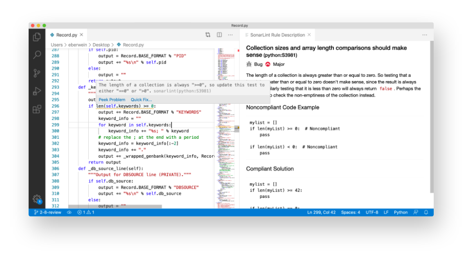
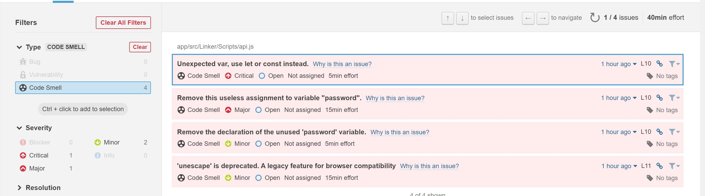
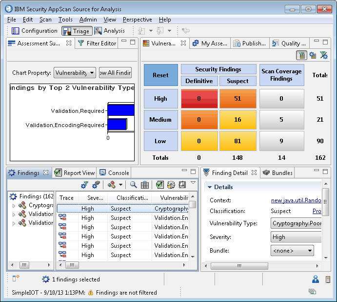
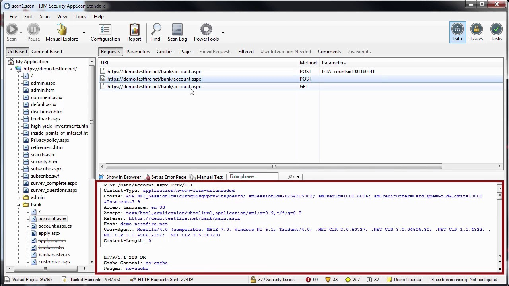
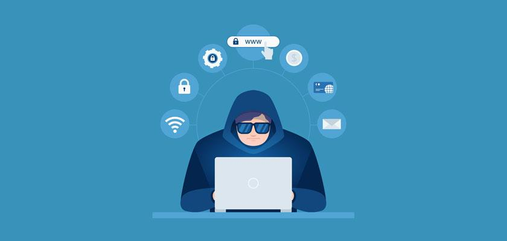
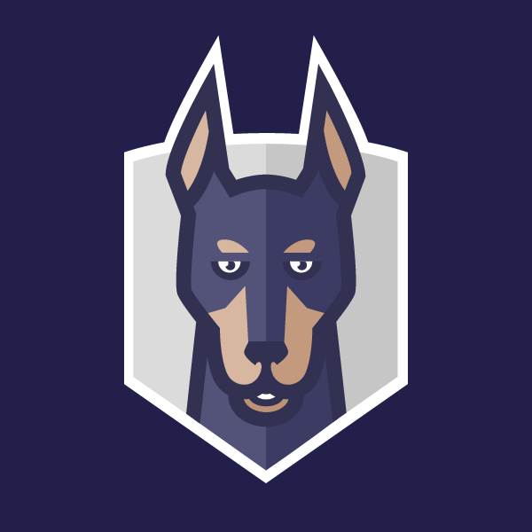
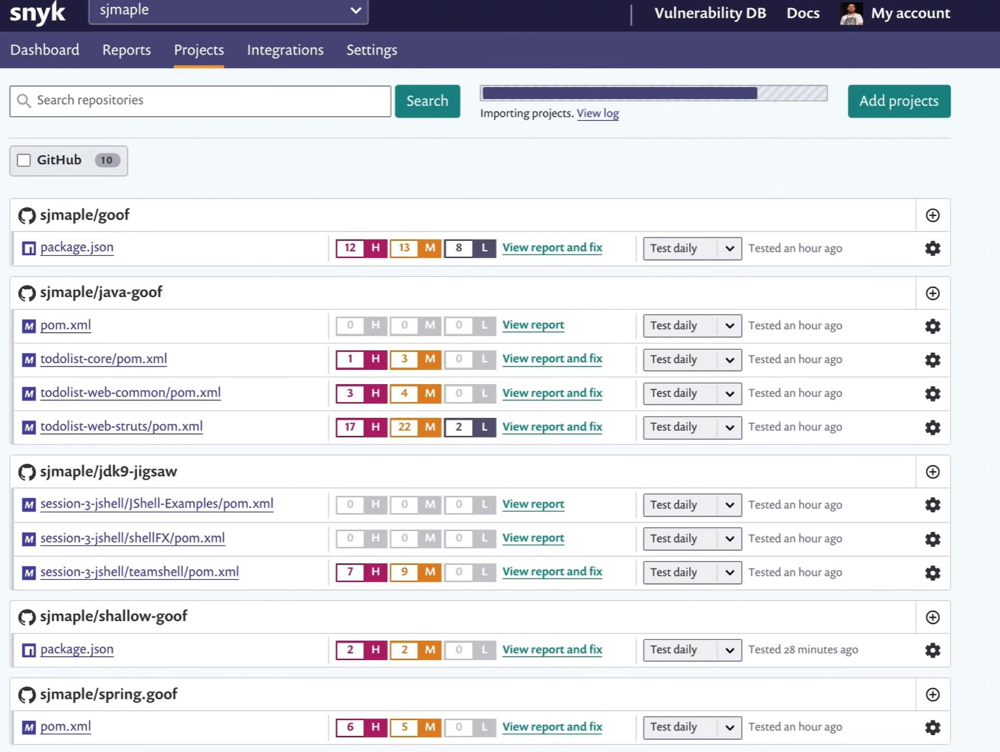
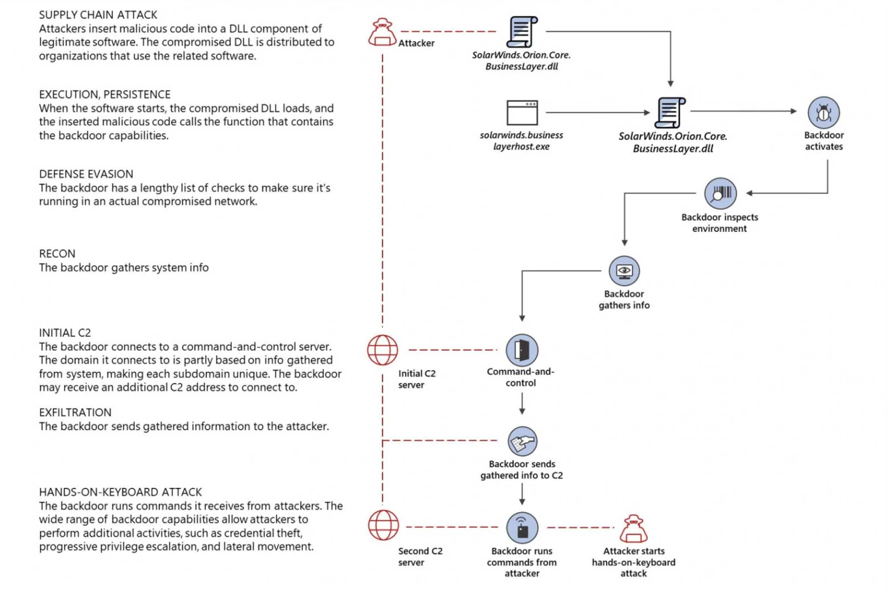
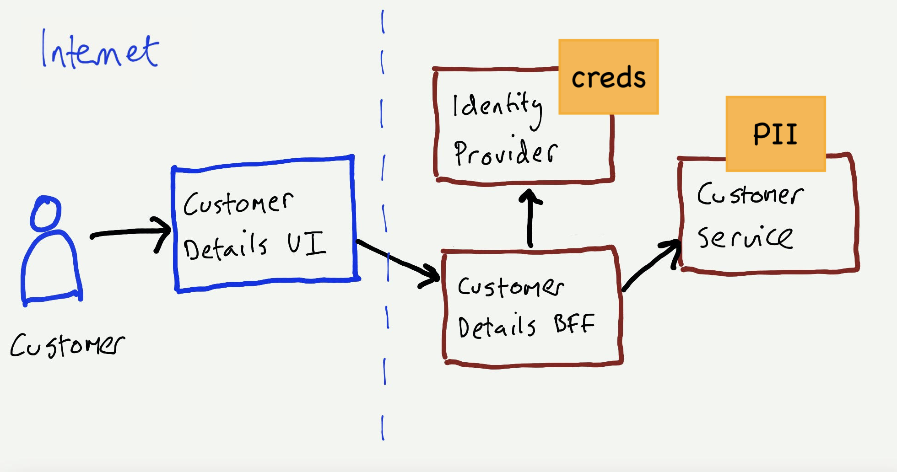

class: center, middle

# dev__SEC__ops

## Seguridad

---

# Agenda

1. Análisis estático de Código Fuente (Static Analysis)
2. Cumplimiento de normativas de Seguridad (Security Compliance checks)
3. Detección activa de vulnerabilidades (Vulnerability detection)
4. Protección en la cadena de suministros (Software Supply Chain Securitys)
5. Secure Development (Desarrollo seguro) + Threat modelling (Modelo de amenazas)
6. Cultura laboral

---

# A Análisis estático de Código Fuente (Static Analysis)

Es como un `linter`

--

pero mas sabroso 🌮

--

A veces conocidos como Static Application Security Testing (SAST)

---

# A Análisis estático de Código Fuente (Static Analysis)

## Sabores 🍬

Hay principalmente dos:

1. Integrado (como un `linter`)

--

2. Estático (se corre una vez el código esta hecho, como las pruebas)

--

  - 😐 Antes: Commit → Build → Test → Deploy

--

  - 😊 Ahora: Commit → **Secure** → Build → Test → Deploy

---

# Static Code Analysis

## Ejemplos - Integrados

- [SonarLint](https://www.sonarlint.org/vscode)

  .img-75[]

---

# Static Code Analysis

## Ejemplos - Estáticos

- [SonarCloud](https://sonarcloud.io/)

  .img-85[]

- [GitHub CodeQL](https://docs.github.com/en/code-security/code-scanning/automatically-scanning-your-code-for-vulnerabilities-and-errors/about-code-scanning)

???
Abrir repositorio y mostrar un commit con errores de vulnerabilidades: https://github.com/saguadob/eiv-devsecops-course/pull/18

---

# Static Code Analysis

Pero ¿cómo funcionan?

La respuesta es [OWASP](https://owasp.org/)

--

🐝

--

(Perdón, no había emoji de avispa)

---

# Static Code Analysis

## OWASP

- **O**pen **W**eb **A**pplication **S**ecurity **P**roject 🐝
- Hacen: Application Security Research
    - Catalogar, documentar y transmitir información para entender y prevenir vulnerabilidades
- The good guys 🦸‍♀️🦸‍♂️🦸
- [OWASP TOP 10](https://owasp.org/Top10/)

---

# Static Code Analysis

## Anatomía de una vulnerabilidad

- Common Weakness Enumeration: **CWE**
  - Catalogar "debilidades"
  - Ejemplo: _CWE-787: Out-of-bounds Write_

--

- Common Vulnerabilities and Exposures: **CVE**
  - Catalogar Vulnerabilidades específicas
  - Ejemplo: _CVE-2021-35212: An SQL injection Privilege Escalation Vulnerability was discovered in the Orion Platform reported by the ZDI Team_

--

- Common Vulnerability Scoring System **CVSS**
  - 0 a 10. None (0), Low (0.1-3.9), Mid (4.0-6.9), High (7.0-8.9), Critical (9.0-10.0)
  - Puntaje del impacto de una vulnerabilidad 😱 basado en multiples factores
  - Ejemplo: _CVE-2021-35212 tiene un puntaje de 9.0_

---

# Cumplimiento de Normativas de Seguridad (Security Compliance Checks)

> Cómo todo en la ingeniería...

--

_DEPENDE_

--

Las empresas tienen sus propios sistemas de compliance

Suelen ser basados en la industria a la que pertenecen (bancaria, industrial, servicios, etc.)

--

Pero existen frameworks como:

- GDPR
- ISO 27001
- entre otros

---

# Security Compliance Checks

En el caso de DevOps pueden ser políticas cómo:

--

- Taggear rescuros apropiadamente

--

- Mantener imágenes de contenedores sin vulnerabilidades

--

- prevenir automáticamente el uso de paquetes con vulnerabilidades

--

- Multi Facot authenticatioin para dispositivos

--

- Encipción de bases de datos

--

- Entrenamientos

--

- Políticas de "4+ eyes principle"

--

- ETC...

---

# Detección activa de vulnerabilidades (Vulnerability detection)

AKA Dynamic Application Security Testing (DAST)

--

Escaneo de aplicación _EN RUNTIME_

--

Básicamente, simular `H4X0RZ`

---

# Detección activa de vulnerabilidades (Vulnerability detection)

Se puede automatizar cómo lost SAST

[Listado de DAST](https://owasp.org/www-community/Vulnerability_Scanning_Tools) por el OWASP

---

# Detección activa de vulnerabilidades (Vulnerability detection)

## Ejemplo

[AppScan](https://www.hcltechsw.com/appscan)

    
    

---

# Detección activa de vulnerabilidades (Vulnerability detection)

## Pen-Testing

Son herramientas útiles pero dependen de la aplicación. 

Para mejores resultados es más comun utilizar Penentration Testing (o Pen-Testing)

--

Personal especializado en explotación de vulnerabilidades. En otras palabras, hackers pagados.

.img-50[]

---

# Protección en la cadena de suministros (Software Supply Chain Security)

- Asegurar los paquetes que se utilizan al crear y desplegar aplicaciones

---

# Software Supply Chain Security

Se trata de asegurar que el código usado por nuestra aplicación (SDK, paquetes, herramients, contenedores) esté también protegido.

Para ello se usa una multitud de herramientas que recolectan datos y analizan los repositorios, herramientas y demás.

--

    

      
Una de las herramientas más comunes es <a href="https://snyk.io/">Snyk</a>

      
    

    

---

# Software Supply Chain Security

## Qué pasa cuando hay un ataque de éste tipo?

Ejemplo: [SOLAR WINDS HACK](https://www.npr.org/2021/04/16/985439655/a-worst-nightmare-cyberattack-the-untold-story-of-the-solarwinds-hack?t=1656688141575)

--

Solar Winds es un proveedor the sistemas de administración y monitoreo de infraestructura.

--

Uno de esos sistemas esl el sistema Orion, utilizado por alreadedor de 30K organizaciones.

--

Se trata de un ataque [Backdoor](https://www.google.com/url?client=internal-element-cse&cx=007930462003869053427:vyjggrsucq4&q=https://owasp.org/www-pdf-archive/OWASP_10_Most_Common_Backdoors.pdf&sa=U&ved=2ahUKEwiapdu-8Nf4AhVkQ_EDHWROCJAQFnoECAAQAQ&usg=AOvVaw3uQ_J1uj7jcYGZk1GJ04Ce) que consiste en implantar un acceso remoto no autorizado a los sistemas atacados.

---

# Software Supply Chain Security

## Solar Winds Attack

.img-75[]

(Tomado de [Bleeping Computer](https://www.bleepingcomputer.com/news/security/the-solarwinds-cyberattack-the-hack-the-victims-and-what-we-know/))

---

# Software Supply Chain Security

## Solar Winds Attack

Aún con herramientas pra prevenir, si el código comprometido viene de una herramienta como el Sistema Operativo. **AÚN SE ES VULNERABLE** 😱😱😱😱😱

---

# Desarrollo Seguro (Secure Development)

Se trata de establecer prácticas conscientes de seguridad informática _durante_ el desarrollo.

--

Prevención > Corrección.

--

Una de las metodologías mas comunes es Threat Modeling (Modelo de amenazas)

--

[STRIDE Framweork](https://en.wikipedia.org/wiki/STRIDE):
- **Spoofing**: Hacerse pasar por alguien mas
- **Tampering**: Modificar data o manipular información "on-the-fly"
- **Repudiation**: Permanecer oculto, no dejar rastro
- **Information Disclosure**: Enviar información a lugares no autorizados
- **Denial of Service**: Degradar el sistema y prevenir que funcione
- **Elevation of Privilege**: Sltar los mecanismos de control de acceso

---

# Desarrollo Seguro (Secure Development)

## Threat Modeling

.img-75[]

Tomado de [A Guide to Threat Modelling for Developers](https://martinfowler.com/articles/agile-threat-modelling.html)

---

# Cultura laboral

Existen varias metodologías y procesos adicionales tales cómo

--

- Asignar expertos en seguridad durante incepción, diseño y arquitectura de los sistemas

--

- Promover buenas prácticas

--

- Corregir problemas de seguridad holísticos en PRs

--

- Entrenamiento en seguridad

--

- Hackatons + CTF