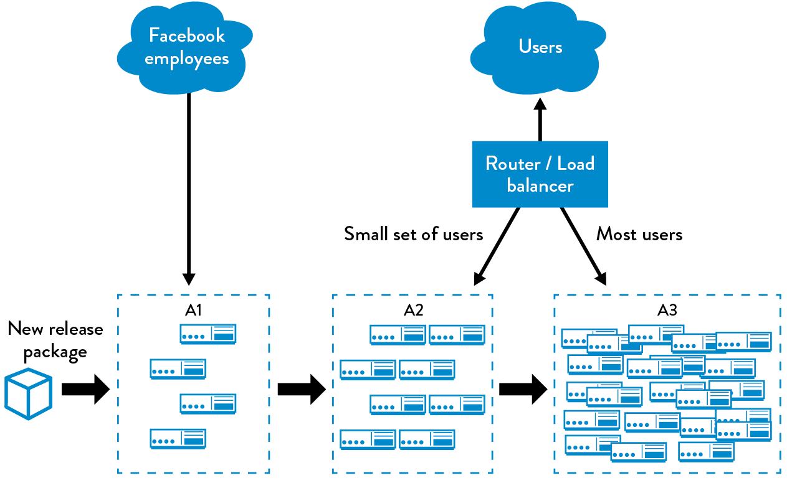

class: center, middle

# Día 3

---
class: center, middle
# DevSecOps

---
.left-column[
# Test
]
.right-column[
- Objetivo final push on Green ✅
- Las pruebas corren en su propio entorno
  - Evitan el dilema de _funciona en mi PC_
  - Primer acercamiento a mepquetar de manera distibuible

]

???
# ? minutos
- Combinación
## TODO
- [ ] poner al final del dia dos infrastructura como codigo y capitulo 9 del libro
---
.left-column[
# Feedback
]
.right-column[
## Pipeline
- Base estructural en el las prácticas DevSecOps
- Consiste de multiples y herramientas y servicios

- Factores de éxito de un pipeline
  - Alto grado de automarización
  - Alto grado de visibilidad de los errores
- Releja el ciclo Devops
]

???
# 10 min
---
.left-column[
# Feedbacl
]
.right-column[
## Continuous integration
.center[]
- Conjunto de
  - Compilación
  - Pruebas automáticas
- Si falla, para todo el proceso de desarrollo
- Recodatorio: trabajar en pequeñas tareas
]

???
# 5 min
- Mencionar que si un cambio es grande, es más desafiante saber que es lo que rompe CI.
---
.left-column[
# Feedback
]
.right-column[
## Test suites
- Unit test
- Acceptance test
- Interation test
- Code Coverage
_Recomendación_: Pensar en paralelismo
### Ideas complementarias
- Atrapar errores lo más pronto posible
- Mucho automático, poco manual
- Test Driven Development
- Con madurez se puede crear _performance testing_
- Testing _no-funcional_
]

???
# 20 min
- 10 minutos corriendo pruebas es ok
- Explicar los riesgos de como se puede empezar a no hacer pruebas
- Code coverage
- Enfatizar en el significado de `done`
- Ejercicio corto de TDD
- `no-funcional` probar dependencias a bibliotecas, OS, etc.
---
.left-column[
# Feedback
]
.right-column[
## Halar la cuerda (_pull the anon cord_)
.center[]
- ✅ `estado verde` tienen que ser confiable
- ❌ `estado rojo` tiene que desaparecer para continuar
  - Devolver / Revertir
  - Arreglar
- No se puede contribuir hasta que vuelva ✅
- Requiere visbilidad
]

???
# 5 min
- Hablar de la cultura de trabajo
- Mostrar / hablar ejemplos de visibilidad
---
.left-column[
# Feeback
]
.right-column[
## La práctica de CI

Ejemplo en [grupo](https://learning.oreilly.com/library/view/the-devops-handbook/9781457191381/DOHB-ch_11.xhtml)

- Pequeños cambios continuos.
- _Trunk based development_.
- Visibilidad de errores aumenta con estas prácticas.
- `Gated commits`
]

???
# 10 min
- Explicar ejemplo de tareas pequeñas
- Expliar que pasa con la baja frecuencia
---
.left-column[
# Feedback
]
.right-column[
## Lanzamientos (_Release_)
- Tradicionalmente se evita esta actividad por miedo al cambio
- Documentación de cambio
- Prerrequisitos para planear
  - Cada entorno objetivo recibe el mismo artefacto.
  - Smoke test
  - Asegurar similitud de los entornos
]

???
# 15 min
- Explicar porque cambios grandes generan miedo
- Explicar visualmente un release
---
.left-column[
# Release
]
.right-column[
- Qué contiene un _pipeline_ de despliegue ideal
  - Artifactos producto de `CI` _apropiados_ para producción
  - Mecanismos de verificación que un entorno está preparado
  - 🖲️👈🏽 _push buttton_
  - Mecanismos de auditoria
  - Smoke testing
- Retroalimentación a quién lo realiza

### Importante:
Escoger tecnologías y arquitecturas que catlicen estos objetivos!
]

???
# 10 min
- Hablar de como la tecnología debe seguir las prácticas y no al contrario.
---
.left-column[
# Release
]
.right-column[
## Despliegue vs Lanzamiento
_Deployment vs Release_
### Despliegue
Instalación de un paquete de software versionado en un entorno
### Lanzamiento
Acción que tiene como resultado que una nueva funcionalidad esté disponible hacia el _cliente_ objetivo.

- Escenario ideal: El lanzamiento de una nueva funcionalidad no debería requerir un despliegue
- Cuando los despliegues se hacen bajo demanda (_on demand_); los lanzamientos dejan de ser una tarea de ingenieria
]

???
# 15 min
- Preguntar que alternativas pueden hacer que hayan lanzamientos sin despliegues.
---
.left-column[
# Release
]
.right-column[
## Patrones de lanzamiento (_release_)
### Basado en entornos
- Se utiliza uno o varios entornos
- Control de tráfico
- No implica un cambio del código fuente de una aplicación
### Basado en aplicaciones
- Hay funcionalidad en el software que controla qué/quién/cuándo
- Cambio en configuración, __no código fuente__.

]

???
# 10 min
- Enfatizar la importancia de poder crear entornos on-demand
- Preguntar ademas de trafico web como más se puede controlar tráfico
- Googlear ejemplos en vivo
---
.left-column[
# Release
Entornos
]
.right-column[
## Blue - Green Deployment
- 2 entornos 🔵🟢
- Solo uno está en uso en cualquier momento.
  _Escuchar tráfico_ 🔵🚥🟢
- Pasos: (Escenario: 🔵 activo, 🟢 inactivo)
  1. Despliegue en 🟢
  2. QA en 🟢
  3. Redireccionar tráfico ➡️🟢 (_este es el lanzamieto_)
  4. Desplegar en 🔵 si es necesario, o _destruir_.
- Fácil de hacer `retrofit`
### Bases de datos? 💽
Alternativas:
- Cada entorno tiene su propia base de datos.
- Hacer que el código fuente sporte varias versiones del modelo de base de datos
  - Cambios aditivos
  - Duplicar información
  - Deprecar de manera secuencial
]

???
# 15 min
- __Aclarar!__ El nombre dice deployment
- Preguntar si es una buena idea tener dos bases de datos
---
.left-column[
# Release
Entornos
]
.right-column[
## Lanzamientos canarios 
(_cannary release_ 🐤)

- Basado en 🔵🟢
- Múltiples entornos
- Se escoge un entorno 🐤 para generar retroalimentación continua.
- Si 🐤 se ve _saludable_, se lanza progresivamente hasta un 100%
- Variación: `Incremental rollout`
.center[]
- _Nice to have_: Si hay monitoreo adecuado, se puede automatizar el lanzamiento. `Gated release`
]
???
# 10 min
- Explicar incremental rollout
- Usar ejemplo de Azure Devops y Twitter
---
.left-column[
# Release
Aplicaciones
]
.right-column[
## Feature flagging 🚩
- Acordarse de [12 factor development](https://12factor.net/)
- El código fuente tiene lógica que habilita funcionalidad basado en _banderas_.
- El encargado hace el lanzamiento:
  - Haciendo cambios en la configuración de la aplicacion
  - Un servicio externo que almacene las 🚩.
- __Importante!__ Las pruebas automaticas de `CI/CD` se hacen con todas las 🚩 activadas!
- Variante: `Dark Launch`
]

???
# 20 min
- Explicar porqué no es deseable hacer cambios directos en la aplicación
- Explicar que consecuencias tiene en un sistema una dependencia externa.
- Buscar ejemplo de [facebook chat dark launch](https://learning.oreilly.com/library/view/the-devops-handbook/9781457191381/DOHB-ch_12.xhtml#:-:text=Case%20Study,of%20Facebook%20Chat%20(2008))
- Actividad en grupo pensemos como hacer un dark launch.
---
.left-column[
# Release
]
.right-column[
## CD vs CD  (?)
_Continuous Deployment vs Continuous Delivery_
> _Continuous Delivery_ es el prerrequisito de _Continuous Deployment_
### Continuous Delivery
Requiere:
- Pequeños trozos de código continuos
- _Trunk_ es estable
- Se puede lanzar cuando se desee
- __Clave__: Tener confianza de que se puede hacer
### Continuous Deployment
Requiere:
- Artefactos _buenos_
- Despiegues regulares
- Alto grado de automatización
- __Clave__: Quien despliega minimiza el riesgo de error
]
Cita textual: 
> Defined this way, continuous delivery is the prerequisite for continuous deployment—just as continuous integration is a prerequisite for continuous delivery. Continuous deployment is likely applicable in the context of web services that are delivered online. However, continuous delivery is applicable in almost every context where we desire deployments and releases that have high quality, fast lead times and have highly predictable, low-risk outcomes, including for embedded systems, COTS products, and mobile apps.
???
# 15 min
- Esta dipositiva habla de low risk enablement
- Explicar que es un artefacto bueno
> At Amazon and Google, most teams practice continuous delivery, although some perform continuous deployment— thus, there is considerable variation between teams in how frequently they deploy code and how deployments are performed. Teams are empowered to choose how to deploy based on the risks they are managing. For example, the Google App Engine team often deploys once per day, while the Google Search property deploys several times per week.
- En grupo pensar como para cosas que no son servicios
> Similarly, most of the cases studies presented in this book are also continuous delivery, such as the embedded software running on HP LaserJet printers, the CSG bill printing operations running on twenty technology platforms including a COBOL mainframe application, Facebook, and Etsy. These same patterns can be used for software that runs on mobile phones, ground control stations that control satellites, and so forth.
---
.left-column[
# Release
]
.right-column[
## Diseñar pensando en bajo riesgo
- Arquitecturas genéricas
  - Monolitos
  - Microservicios
- Tabla de comparación

]

???
# 20 min
![tabla de comparación]
---