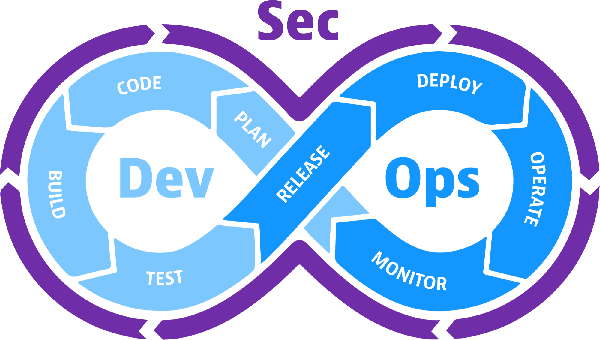
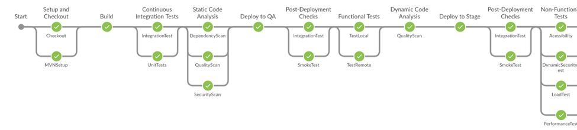
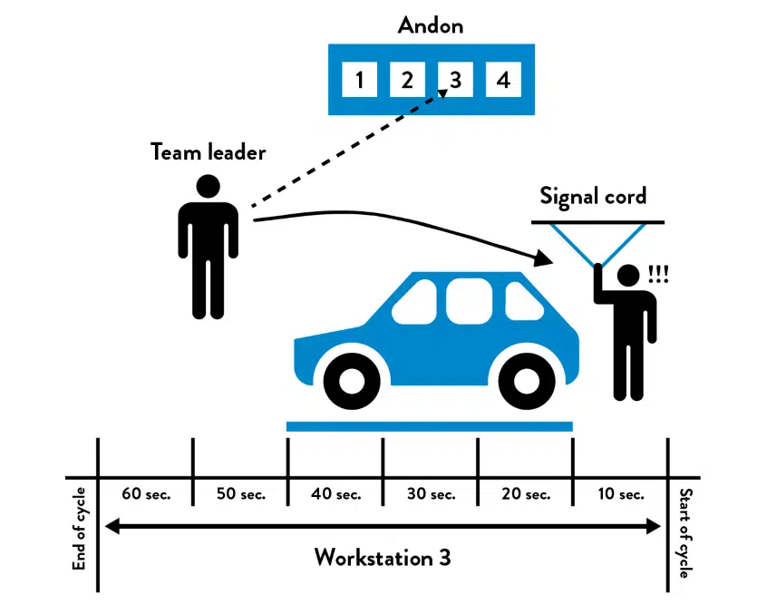

class: center, middle

# Día 3

---
class: center, middle
# DevSecOps

---
.left-column[
# Test
]
.right-column[
- Objetivo final push on Green ✅
- Las pruebas corren en su propio entorno
  - Evitan el dilema de _funciona en mi PC_
  - Primer acercamiento a mepquetar de manera distibuible

]

???
# ? minutos
- Combinación
## TODO
- [ ] poner al final del dia dos infrastructura como codigo y capitulo 9 del libro
---
.left-column[
# Feedback
]
.right-column[
## Pipeline
- Base estructural en el las prácticas DevSecOps
- Consiste de multiples y herramientas y servicios

- Factores de éxito de un pipeline
  - Alto grado de automarización
  - Alto grado de visibilidad de los errores
- Releja el ciclo Devops
]

???
# 10 min
---
.left-column[
# Feedbacl
]
.right-column[
## Continuous integration
.center[]
- Conjunto de
  - Compilación
  - Pruebas automáticas
- Si falla, para todo el proceso de desarrollo
- Recodatorio: trabajar en pequeñas tareas
]

???
# 5 min
- Mencionar que si un cambio es grande, es más desafiante saber que es lo que rompe CI.
---
.left-column[
# Feedback
]
.right-column[
## Test suites
- Unit test
- Acceptance test
- Interation test
- Code Coverage
_Recomendación_: Pensar en paralelismo
### Ideas complementarias
- Atrapar errores lo más pronto posible
- Mucho automático, poco manual
- Test Driven Development
- Con madurez se puede crear _performance testing_
- Testing _no-funcional_
]

???
# 20 min
- 10 minutos corriendo pruebas es ok
- Explicar los riesgos de como se puede empezar a no hacer pruebas
- Code coverage
- Enfatizar en el significado de `done`
- Ejercicio corto de TDD
- `no-funcional` probar dependencias a bibliotecas, OS, etc.
---
.left-column[
# Feedback
]
.right-column[
## Halar la cuerda (_pull the anon cord_)
.center[]
- ✅ `estado verde` tienen que ser confiable
- ❌ `estado rojo` tiene que desaparecer para continuar
  - Devolver / Revertir
  - Arreglar
- No se puede contribuir hasta que vuelva ✅
- Requiere visbilidad
]

???
# 5 min
- Hablar de la cultura de trabajo
- Mostrar / hablar ejemplos de visibilidad
---
.left-column[
# Feeback
]
.right-column[
## La práctica de CI

Ejemplo en [grupo](https://learning.oreilly.com/library/view/the-devops-handbook/9781457191381/DOHB-ch_11.xhtml)

- Pequeños cambios continuos.
- _Trunk based development_.
- Visibilidad de errores aumenta con estas prácticas.
- `Gated commits`
]

???
# 10 min
- Explicar ejemplo de tareas pequeñas
- Expliar que pasa con la baja frecuencia
---
.left-column[
# Feedback
]
.right-column[
## Lanzamientos (_Release_)
- Tradicionalmente se evita esta actividad por miedo al cambio
- Documentación de cambio
- Prerrequisitos para planear
  - Cada entorno objetivo recibe el mismo artefacto.
  - Smoke test
  - Asegurar similitud de los entornos
]

???
# 15 min
- Explicar porque cambios grandes generan miedo
- Explicar visualmente un release
---
.left-column[
# Release
]
.right-column[
- Qué contiene un _pipeline_ de despliegue ideal
  - Artifactos producto de `CI` _apropiados_ para producción
  - Mecanismos de verificación que un entorno está preparado
  - 🖲️👈🏽 _push buttton_
  - Mecanismos de auditoria
  - Smoke testing
- Retroalimentación a quién lo realiza

### Importante:
Escoger tecnologías y arquitecturas que catlicen estos objetivos!
]

???
# 10 min
- Hablar de como l tecnología debe seguir las prácticas y no al contrario.
---